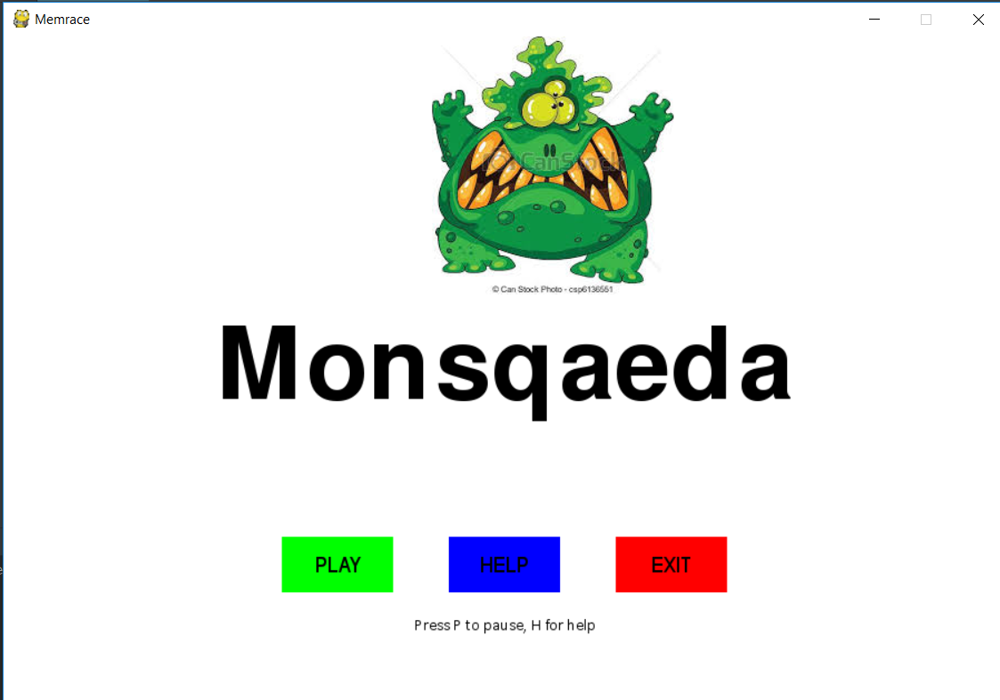
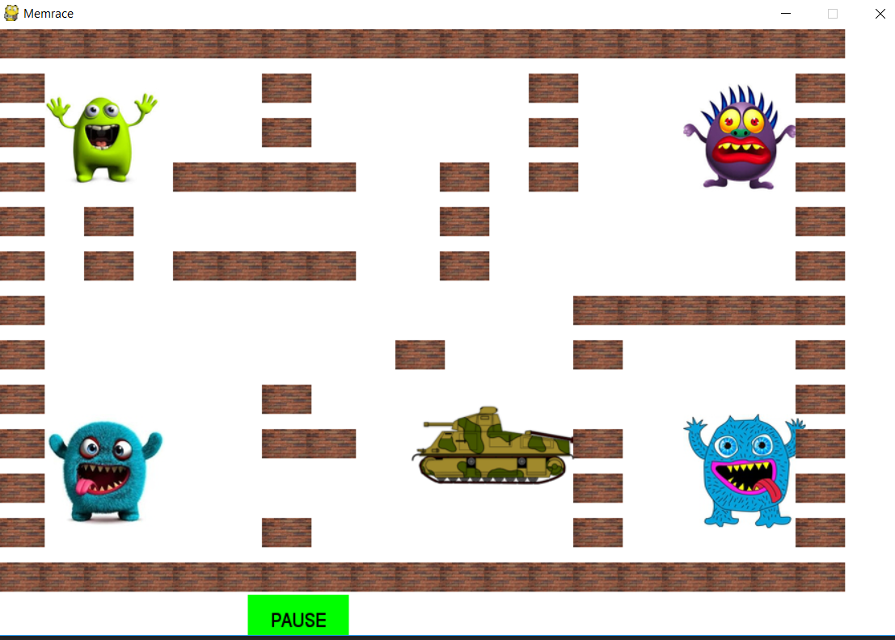
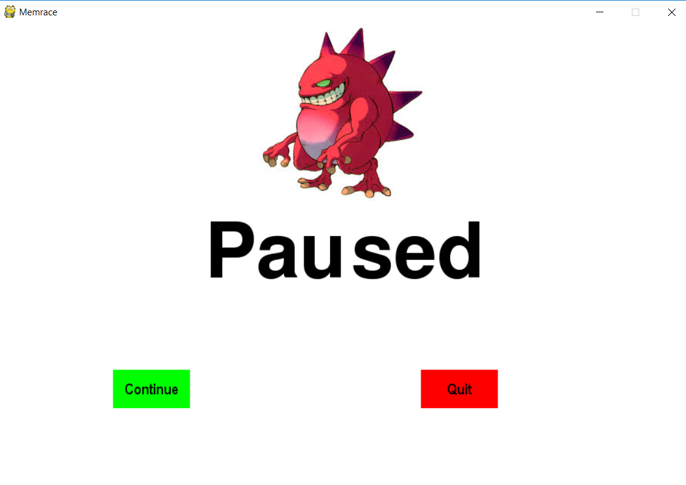

# BUILDING A SIMPLE GAME WITH PYGAME
I started making this game whilst following a pygame tutorial series by Cory Schafer on YouTube.

# FEATURES
This game has an introductory page with 3 buttons: PLAY, PAUSE AND HELP.
By pressing the key P and the key H, the Pause and help events can also be activated.



The main game page has 4 monsters at the corners of the game window. 
The game window also has a maze that was done using a matrix of ones and zeros. 



Another page of the game is the pause page, which has the exit and the continue button.


# HOW TO RUN THE CODE
To run the code, you need to have python installed. Afterwards, you need to have pygame installed.
If you do not have pygame, you can use pip to install it by using the command: pip install pygame.

# HOW THE CODE WORKS
The program depends on some imports like pygame, random, time andd tkinter modules.

Colors are pygame are defined using the RGB color system. 
```
#        R  G  B
black = (0, 0, 0)
```


The pygame init function is called after importing the pygame module and before calling any other Pygame function.  A pygame.time.Clock object makes sure that the program runs at a certain maximum Frames per Second(FPS – measures the number of images the program draws per second). This Clock object will ensure that our game programs don’t run too fast by putting in small pauses on each iteration of the game loop.
```
pygame.init()
gameDisplay = pygame.display.set_mode((width, height))
pygame.display.set_caption('Monster escape')
clock = pygame.time.Clock()
```

The images were loaded using pygame.image.load(‘path/to/image’). Pygame is able to load images(or sprites) onto Surface objects from PNG, JPG, GIF, and BMP image files. The pygame.image.load() function  returns a separate Surface object (different from the display Surface Object) with the image on it.  To copy the image from the Surface object to the display screen, the blit function is used. 
```
carImg = pygame.image.load('img/tnk.png')
```


The Clock object’s tick() method should be called at the very end of the game loop, after the call to pygame.display.update()

